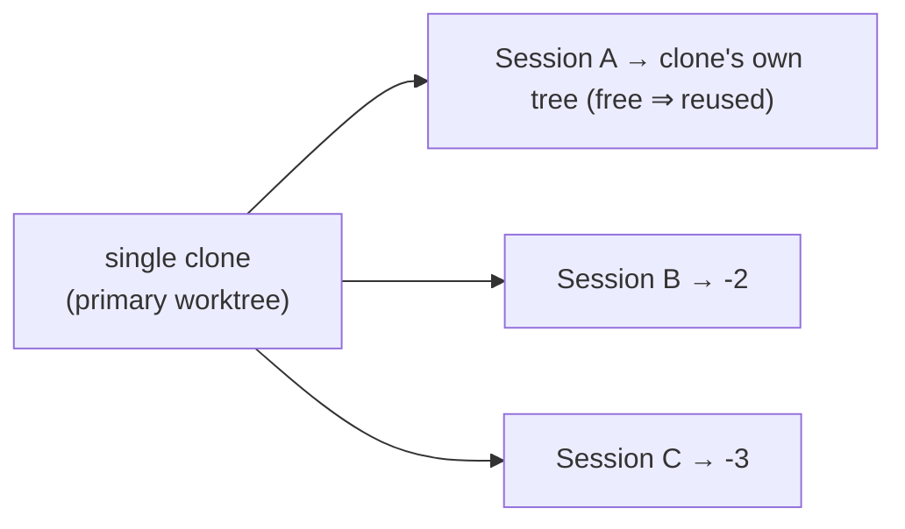

# Worktree isolation for concurrent sessions

One clone per repo. Concurrency comes from **linked worktrees hanging off that
clone**, not from keeping spare clones and remembering which is free.

- A session **reuses the clone's own tree when it is free** — git's primary
  checkout is itself a worktree.
- Only a **concurrent** session — one arriving while the clone's tree is already
  bound to a live session — spills into a linked worktree at `<clone>-2`,
  `<clone>-3`, … beside the clone. Never nested under it: a coding harness
  recurses its working tree and would edit sibling worktrees it must not touch.
- A worktree is **reaped only when its session ends**, and a session **cannot
  end while its tree holds undurable work**. No commit is stranded by teardown.
- **Opt-in per repo, default off.** Disabled, the code path is today's.



Everything below lives in `src/commands/sessions/daemon/worktree/`.

## Allocation

`spawn` and `spawnAssist` route through `spawnInTree.ts`, which calls
`allocateTree(requestedCwd, boundTreeRoots)` before `spawnWith`, then binds the
result onto the new session. `boundTreeRoots` is every live session's `cwd`
mapped through `findRepoRoot` — the live map is the authority on which trees are
bound. `planAllocation` returns `primary` unless the clone is already in that
set, in which case `createWorktree` runs:

```
git config push.default upstream            (on the clone)
git worktree add --track -b <repo>-N <path> origin/<trunk>
```

The branch takes the worktree directory's name. `nextWorktreePath` walks up from
`-2` and skips any suffix that is a registered worktree, an existing path, a
bound tree, or an existing local branch — so it never clobbers a real clone.
Each new worktree is recorded in `~/.assist/worktrees.json` (path → clone +
origin), which is what makes cleanup possible after the directory is gone.

This is race-free within a host: the daemon is one Node process and allocation is
synchronous, so two near-simultaneous spawns cannot both claim the primary tree.
Cross-host WSL↔Windows repos are different clones on different filesystems, so
there is no shared tree to race — `git.ts` shells `git.exe -C <path>` for `C:\`
paths, keeping every worktree operation on the side that owns the checkout.

`resume` does not allocate; `resumeInTree` binds whatever worktree the recorded
`cwd` already is, via `detectExistingWorktree`.

## Seeding

`git worktree add` populates tracked files only, so a fresh worktree cannot
build. `seedWorktree` copies the configured gitignored files (`worktree.copy`)
and runs a dependency install (`worktree.install` — auto-detected from the
lockfile, or an explicit command).

**The harness waits for seeding.** A session allocated a freshly created
worktree is spawned with `holdUntilSeeded`, so `startOrHoldPty` parks the pty
factory on `session.pendingStart` instead of running it. `seedWorktree`'s
completion callback then fires `startHeldSession`, which starts the pty, applies
any pending resize, and wires its events. Without this the harness would race an
in-flight `npm install` in its own working directory. `startHeldSession` also
checks the card still exists — a session dismissed mid-seed never starts.

`node_modules` is never shared or symlinked — two worktrees on branches with
divergent lockfiles would corrupt each other through a shared tree, and
concurrent installs would race it. Each worktree installs its own. With pnpm
that is cheap (hardlinks into the global store); with npm/yarn it pays full disk
and time. Reflink CoW would fix that but is unavailable here — WSL repos are on
ext4 and the Windows host is NTFS, neither of which supports it.

## The durability gate

A worktree-backed session reaching `done` does not go straight there — unless it
is about to chain into more work. `applyStatusChange` asks `shouldAutoRun` about
the _proposed_ status first: a card carrying straight on (a drafted item picked
up by auto-run, a run advancing to its next phase) keeps its worktree and skips
the gate entirely, because end of life means the stream is over, not that one
command in it finished.

Otherwise the session is marked `closing` (broadcast immediately, so the card
reflects the wait) and handed to `resolveDoneDurability`, which shells out to git
(async, unlike the sync status pipeline) and checks:

```
tree clean (git status --porcelain empty)
  AND (commit.push  OR  HEAD reachable from some remote branch)
```

`commit.push` means the repo pushes on every commit, so its commits are already
remote. A `push:false` repo's commits sit local-only until a PR or manual push —
that is the case the gate catches, via `git branch -r --contains HEAD`.

Durable → reap, then the transition completes. Undurable → the session is held
in the **`stopped`** status with `session.undurable = { reason }`
(`"uncommitted changes"` or `"unpushed commits"`), which the card shows. A
`stopped` session ignores further hook-driven status pushes
(`applySetStatus.ts`).

Held sessions are never trapped. `watchGitState` watches the tree's git common
dir and re-runs the gate on change, so the moment the branch is pushed the
session reaps and closes itself. Failing that, the card offers restart, or an
explicit **discard** that names what it destroys — the only path that removes an
undurable tree.

## Reap

`reapWorktree` runs `git worktree remove` (`--force` only on discard) and then
deletes the worktree's branch, unless the clone has it checked out. Callers:

- `resolveDoneDurability` — clean end of life, gated.
- `dismissSessionGated` — the user closing a card. With a live pty it sets
  `session.pendingDismiss` and kills the process tree first; `handlePtyExit`
  invokes the callback once the process is actually gone, which then either
  gates (dismiss) or force-reaps (discard).
- `reconcileWorktreesOnRestore` — startup, gated.

## Startup reconcile

A worktree whose session died while the daemon was down is pointed at by nothing
live or persisted. On `restore()`, `reconcileWorktreesOnRestore` binds worktrees
back onto restored sessions, then walks `~/.assist/worktrees.json`:

```
accounted = live session cwds ∪ persisted session cwds
for each registry entry not accounted:
  still on disk → reapWorktree (durability-gated; undurable trees are left)
  gone          → git worktree prune + git branch -d (kept if unmerged)
```

`rearmStoppedSessions` then re-arms the git watcher for every restored `stopped`
session, so a hold survives a daemon restart and still resolves itself.

## Transcripts and the History tab

Claude Code keys transcripts by cwd — `~/.claude/projects/<encoded-cwd>/` — so a
worktree session's transcript lands in its own project dir. Two consequences:

- **Transcripts survive reap.** They live under `~/.claude`, so removing a
  worktree never loses conversation history. The transcript also stores its own
  `meta.cwd`.
- **History sprawls.** `uniqueRepos` and `groupSessionsByRepo` bucket by `cwd`,
  so every `<clone>-N` becomes its own entry. Fixed by grouping on origin
  instead — see below.

Because suffixes are reused, a reaped `<clone>-2` and a later unrelated
`<clone>-2` share one project dir. Under origin-grouped history that is one
bucket anyway and each session stays a distinct `.jsonl`, so nothing merges.
Documented, not fixed.

## Config

`worktree` in `assistConfigSchema`, surfaced in `--help` via
`sessionsConfigHelp.ts`:

| Key                | Default                                                      | Effect                                                                                  |
| ------------------ | ------------------------------------------------------------ | --------------------------------------------------------------------------------------- |
| `worktree.enabled` | `false`                                                      | off ⇒ `allocateTree` always returns the requested cwd                                   |
| `worktree.root`    | the clone's parent                                           | where `<repo>-N` worktrees are created                                                  |
| `worktree.install` | `true`                                                       | `true` auto-detects the package manager; a string is an explicit command; `false` skips |
| `worktree.copy`    | `.env`, `settings.local.json`, `.claude/settings.local.json` | gitignored files copied into a new worktree                                             |

Set per repo without committing anything to it:
`assist config set worktree.enabled true -g --repo`, which writes a `repos:`
entry in `~/.assist.yml` keyed by origin (`resolveRepoOverride.ts`).

## Not yet covered

- **Grouping by origin.** The live selector and History still bucket by `cwd`
  (`uniqueRepos.ts`, `groupSessionsByRepo.ts`), so worktree sessions sprawl into
  separate entries. Resolve origin live via git for existing trees and via the
  registry for reaped ones.
- **`review` still uses the shared tree.** `checkoutPr` (`review/review.ts`)
  runs `gh pr checkout N` against whatever is checked out. Routing it through
  `allocateTree` would keep a PR checkout off in-progress work.
- **`spawnRun` does not allocate** — server runs always use the requested cwd.
